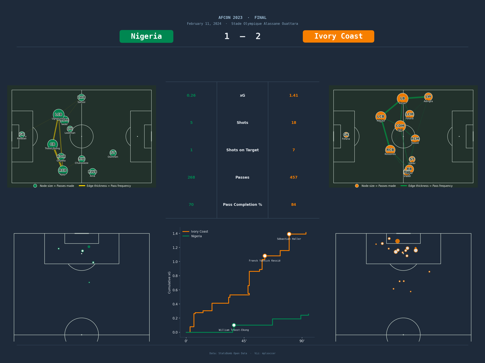

# AFCON 2023 Final - Match Analysis Dashboard

A Python-based football analytics dashboard for the 2023 Africa Cup of Nations Final: **Nigeria 1 - 2 Cote d'Ivoire** (February 11, 2024), built using StatsBomb open event data and `mplsoccer`.



---

## Overview

The project produces a single, publication-ready figure that summarises the key tactical and statistical story of the match across four panels:

| Panel | Description |
|---|---|
| **Passing Networks** | Average player positions and pass connections for each team (pre-substitution, open-play only) |
| **Shot Maps** | All shot attempts plotted on a vertical half-pitch, sized by xG value |
| **Match Statistics Table** | Side-by-side comparison of xG, shots, shots on target, passes, and pass completion % |
| **xG Flow Chart** | Cumulative xG over time for both teams, with goals annotated by scorer name |

---

## Repository Structure

```
football-match-dashboard/
├── README.md
├── requirements.txt
│
├── images/
│   └── afcon2023_final_dashboard.png
│
├── notebooks/
│   └── afcon2023_final_dashboard.ipynb
│
└── reports/
    └── afcon2023_final_report.pdf
```

---

## Data Source

All data is sourced from **StatsBomb Open Data**, accessed via the `statsbombpy` library.

| Parameter | Value |
|---|---|
| Competition ID | 1267 |
| Season ID | 107 |
| Match ID | 3923881 |

No API key or subscription is required. StatsBomb provides this data for free.

---

## Tech Stack

| Library | Purpose |
|---|---|
| `statsbombpy` | Loading and querying StatsBomb open event data |
| `mplsoccer` | Drawing football pitches; `Sbopen` parser for position data |
| `matplotlib` | Figure layout, all visual panels, and rendering |
| `pandas` | Event data manipulation and filtering |
| `numpy` | Interpolation for node/edge sizing |
| `Pillow` | Image handling utilities |

---

## Getting Started

### 1. Clone the repository

```bash
git clone https://github.com/ashpe-osk/football-match-dashboard
cd football-match-dashboard
```

### 2. Install dependencies

```bash
pip install -r requirements.txt
```

### 3. Run the notebook

Open `notebooks/afcon2023_final_dashboard.ipynb` in Jupyter and run all cells. The dashboard will be saved to `images/afcon2023_final_dashboard.png`.

---

## Methodology

### Passing Networks
Only completed, open-play passes made **before the first substitution** are included, so the network reflects the starting formation. Each player node is placed at their average pass location and scaled by passes made. Edges are drawn only where a minimum pass threshold is met, with thickness and opacity interpolated by frequency.

### Shot Maps
Each shot is plotted at its recorded coordinate on a vertical half-pitch. Marker size scales with the StatsBomb xG value. Goals are filled with the team colour; non-goals are hollow circles with a coloured edge.

### Match Statistics Table
Compares both teams across: xG, total shots, shots on target, total passes, and pass completion %.

### xG Flow Chart
Cumulative xG is plotted against match minute for both teams. Goal events are marked with the scorer's name. X-axis is labelled at 0', 45', and 90'.

---

## Key Findings

- Cote d'Ivoire created more and higher-quality chances throughout the match, particularly after half-time where they overturned Nigeria's lead.
- Nigeria's passing network showed a compact, central structure; Cote d'Ivoire's showed greater width and involvement from wide positions.
- Cote d'Ivoire led across all major statistics: xG (1.41 vs 0.26), shots (18 vs 5), shots on target (7 vs 1), passes (457 vs 268), and pass completion % (84 vs 70).

---

## Future Improvements

The dashboard is currently built around this specific match. Planned next steps are to extend and automate the project in two directions:

1. **Automated match dashboard** -- the pipeline will be updated so that it can generate the full dashboard for any match available in the StatsBomb Open Data catalogue with minimal manual input. The intended workflow is:
   - The user provides a competition name, season, and match via a web app.
   - The pipeline automatically fetches the correct event data, resolves team names and colours, and runs all the necessary visualisation functions.
   - The visuals are then displayed to the user as per their requirements.

2. **Broader football analytics dashboard** -- additional visualisations will be added to allow users to explore and compare teams and players across any competition and season available in the StatsBomb Open Data catalogue. The AFCON 2023 Final serves as the initial template and proof of concept; the end goal is a fully reusable analytics tool that works across any supported tournament or league -- Premier League, FIFA World Cup, UEFA Euro, and beyond.

---

## Credits

- **Data:** [StatsBomb Open Data](https://github.com/statsbomb/open-data)
- **Visualisation:** [mplsoccer](https://mplsoccer.readthedocs.io/)
- **Author:** Oseko Ashpe
- **LinkedIn:** [linkedin.com/in/ashpe-ayubu](https://www.linkedin.com/in/ashpe-ayubu/)
